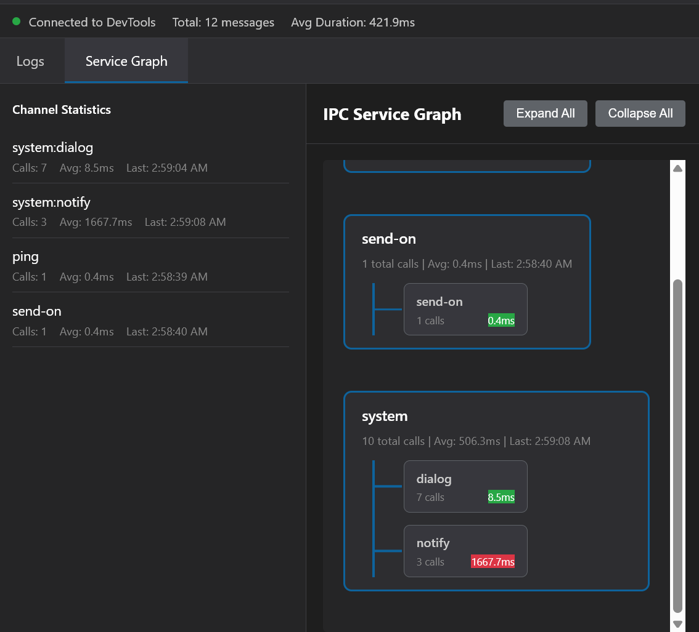

This repository contains an Electron application that monitors and logs Inter-Process Communication (IPC) events between the main and renderer processes. It provides a user-friendly interface to visualize IPC messages, making it easier for developers to debug and understand the communication flow within their Electron applications. 

#### This is only for development purposes. It is ```not``` recommended to use this in production as it may have performance implications.


## Features
- Real-time logging of IPC messages.
- Visualization of IPC communication flow.
- Performance monitoring of IPC events.

## Description
1. This extension shows the data transfer between various channels in the main and renderer processes.
2. It captures IPC messages sent via `ipcMain` and `ipcRenderer` and displays them in a structured format.
3. The graphical representations consolidates the channels having same purpose such as ```system:notify``` and ```system:dialog```. It uses ```system``` as the main channel and shows the sub-channels in the details section.

4. The extension also provides performance metrics for each IPC event, helping developers identify potential bottlenecks in their communication flow.


## Installation
1. Clone the repository

2. Copy the extension folder to your Electron app's directory (Absolute path) and follow these steps.

 ```bash
    import {app,BrowserWindow} from 'electron';
    let win: BrowserWindow | null = null;
```
```bash
    import { hookIpcMain } from '../src' // And pass win in the hookIpcMain

    hookIpcMain(win);
```

3. Add callback function in preload of your electron app


```bash
contextBridge.exposeInMainWorld("api", {
    onIpcLogData: (callback: (data: any) => void) => {
        ipcRenderer.on('ipc-log-data', (_event, data) => callback(data));
    },
    // Remove listener when needed
    removeIpcLogDataListener: () => {
        ipcRenderer.removeAllListeners('ipc-log-data');
    },
});
```

4. Add helper to send data to the extension window
```bash
function sendToDevTools(logData: any) {
  // Send via postMessage to the renderer process
  // The content script will pick this up
  if (typeof window !== 'undefined') {
    window.postMessage({
      type: 'IPC_LOG',
      log: logData
    }, '*');
  }
}

(window as any).api.onIpcLogData((logData: any) => {
    sendToDevTools(logData);
});
```

5. The extension is ready to use. Open the developer tools in your Electron app and navigate to the "IPC Monitor" tab to view the logged IPC events.

